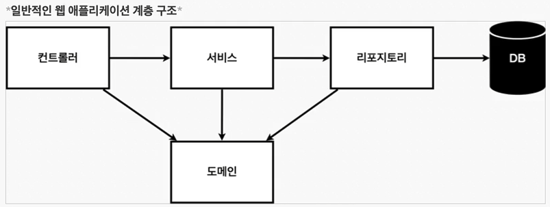
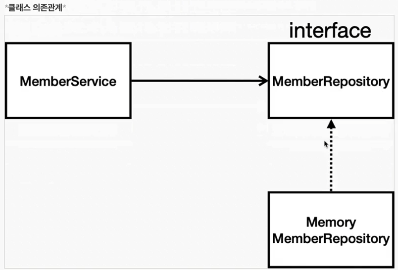
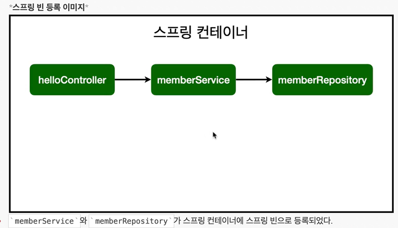

## MVC와 템플릿 엔진

Model, View, Controller


### Controller

내부적 처리

로직

### View

온전히 보여지는데 집중

### Model


## API



* 컨트롤러: 웹 MVC의 컨트롤러 역할
* 서비스: 핵심 비즈니스 로직 구현
* 리포지토리: 데이터베이스에 접근, 도메인 객체를 DB에 저장하고 관리
* 도메인: 비즈니스 도메인 객체, 예) 회원, 주문, 쿠폰 등등 주로 데이터베이스에 저장하고 관리됨




* 아직 데이터 저장소가 선정되지 않아서, 우선 인터페이스로 구현 클래스를 변경할 수 있도록 설계
* 데이터 저장소는 RDB, NoSQL 등등 다양한 저장소를 고민중인 상황으로 가정
* 개발을 진행하기 위해서 초기 개발 단계에서는 구현체로 가벼운 메모리 기반의 데이터 저장소 사용


#### 인터페이스(interface)란?

자식 클래스가 여러 부모 클래스를 상속받을 수 있다면, 다양한 동작을 수행할 수 있다는 장점을 가지게 될 것입니다.

하지만 클래스를 이용하여 다중 상속을 할 경우 메소드 출처의 모호성 등 여러 가지 문제가 발생할 수 있어 자바에서는 클래스를 통한 다중 상속은 지원하지 않습니다.

 

하지만 다중 상속의 이점을 버릴 수는 없기에 자바에서는 인터페이스라는 것을 통해 다중 상속을 지원하고 있습니다.

인터페이스(interface)란 다른 클래스를 작성할 때 기본이 되는 틀을 제공하면서, 다른 클래스 사이의 중간 매개 역할까지 담당하는 일종의 추상 클래스를 의미합니다.

 

자바에서 추상 클래스는 추상 메소드뿐만 아니라 생성자, 필드, 일반 메소드도 포함할 수 있습니다.

하지만 인터페이스(interface)는 오로지 추상 메소드와 상수만을 포함할 수 있습니다.


#### 인터페이스의 선언

자바에서 인터페이스를 선언하는 방법은 클래스를 작성하는 방법과 같습니다.

인터페이스를 선언할 때에는 접근 제어자와 함께 interface 키워드를 사용하면 됩니다.

 

자바에서 인터페이스는 다음과 같이 선언합니다.

```java
// 문법
접근제어자 interface 인터페이스이름 {

  public static final 타입 상수이름 = 값;

  ...

  public abstract 메소드이름(매개변수목록);

  ...

}
```


단, 클래스와는 달리 인터페이스의 모든 필드는 public static final이어야 하며, 모든 메소드는 public abstract이어야 합니다.

이 부분은 모든 인터페이스에 공통으로 적용되는 부분이므로 이 제어자는 생략할 수 있습니다.

이렇게 생략된 제어자는 컴파일 시 자바 컴파일러가 자동으로 추가해 줍니다.


#### 추상 메소드(abstract method)

추상 메소드(abstract method)란 자식 클래스에서 반드시 오버라이딩해야만 사용할 수 있는 메소드를 의미합니다.

자바에서 추상 메소드를 선언하여 사용하는 목적은 추상 메소드가 포함된 클래스를 상속받는 자식 클래스가 반드시 추상 메소드를 구현하도록 하기 위함입니다.

 

예를 들면 모듈처럼 중복되는 부분이나 공통적인 부분은 미리 다 만들어진 것을 사용하고, 이를 받아 사용하는 쪽에서는 자신에게 필요한 부분만을 재정의하여 사용함으로써 생산성이 향상되고 배포 등이 쉬워지기 때문입니다.

 

이러한 추상 메소드는 선언부만이 존재하며, 구현부는 작성되어 있지 않습니다.

바로 이 작성되어 있지 않은 구현부를 자식 클래스에서 오버라이딩하여 사용하는 것입니다.

 

자바에서 추상 메소드는 다음과 같은 문법으로 선언합니다.

```java
// 문법
abstract 반환타입 메소드이름();
```

 

위와 같이 선언부만 있고 구현부가 없다는 의미로 선언부 끝에 바로 세미콜론(;)을 추가합니다.


------

#### 추상 클래스(abstract class)

자바에서는 하나 이상의 추상 메소드를 포함하는 클래스를 가리켜 추상 클래스(abstract class)라고 합니다.

이러한 추상 클래스는 객체 지향 프로그래밍에서 중요한 특징인 다형성을 가지는 메소드의 집합을 정의할 수 있도록 해줍니다.

즉, 반드시 사용되어야 하는 메소드를 추상 클래스에 추상 메소드로 선언해 놓으면, 이 클래스를 상속받는 모든 클래스에서는 이 추상 메소드를 반드시 재정의해야 합니다.

 

자바에서 추상 클래스는 다음과 같은 문법으로 선언합니다.

```java
// 문법
abstract class 클래스이름 {

  ...

  abstract 반환타입 메소드이름();

  ...

}
```

이러한 추상 클래스는 동작이 정의되어 있지 않은 추상 메소드를 포함하고 있으므로, 인스턴스를 생성할 수 없습니다.

추상 클래스는 먼저 상속을 통해 자식 클래스를 만들고, 만든 자식 클래스에서 추상 클래스의 모든 추상 메소드를 오버라이딩하고 나서야 비로소 자식 클래스의 인스턴스를 생성할 수 있게 됩니다.


---

### 접근 제어자

**private**

접근제어자가 private으로 설정되었다면 private 이 붙은 변수, 메서드는 해당 클래스에서만 접근이 가능하다.

**default**

접근 제어자를 별도로 설정하지 않는다면 접근 제어자가 없는 변수, 메서드는 default 접근 제어자가 되어 해당 패키지 내에서만 접근이 가능하다.

**protected**

접근제어자가 protected로 설정되었다면 protected가 붙은 변수, 메서드는 동일 패키지의 클래스 또는 해당 클래스를 상속받은 다른 패키지의 클래스에서만 접근이 가능하다.

**public**

접근제어자가 public으로 설정되었다면 public 접근제어자가 붙은 변수, 메서드는 어떤 클래스에서라도 접근이 가능하다.


### implemetns(상속)

부모 객체는 선언만 하며 정의(내용)은 자식에서 오버라이딩 (재정의) 해서 사용해야함


### 회원 도메인과 리포지토리 만들기


### 회원 리포지토리 테스트 케이스 작성

개발한 기능을 실행해서 테스트 할 때 자바의 main 메서드를 통해서 실행하거나

웹 애플리케이션의 컨트롤러를 통해서 해당 기능을 실행

but 여러 테스트를 한번에 실행하기 어려움

=> 테스트 케이스


> 테스트는 순서 보장 X
>
> 의존 관계 없이 설계 되어야함
>
> 하나 끝날 때 마다 저장소, 공용 데이터 지워줘야 함

> TDD : 테스트 주도 개발
>
> 테스트 먼저 만들고 클래스 만들어서 돌려 보는거


## 빈(Bean)

스프링 IoC 컨테이너가 관리하는 자바 객체

POJO(Plain Old Java Object)를 bean이라고 부름

Spring Framework에서는 ApplicationContext.getBean()과 같은 메서드로 직접 호출 가능




### 스프링 빈 등록 2가지 방법

* 컴포넌트 스캔과 자동 의존관계 설정
* 자바 코드로 직접 스플이 빈 등록


### 컴포넌트 스캔과 자동 의존관계 설정

* '@Component' annotation이 있으면 스프링 빈으로 자동 등록
* '@Controller' 컨트롤러가 스프링 빈으로 자동 등록된 이유도 컴포넌트 스캔 때문
* '@Component'를 포함하는 다음 annotation도 스프링 빈으로 자동 등록
  * @Controller
  * @Service
  * @Repository


> 스프링은 스프링 컨테이너에 스프링 빈을 등록할 때, 기본으로 싱글톤으로 등록
>
> 유일하게 하나만 등록해서 공유
>
> 따라서 같은 스프링 빈이면 모두 같은 인스턴스
>
> 설정으로 싱글톤이 아니게 설정할 수 있지만 특별한 경우를 제외하면 대부분 싱글톤 사용


### 싱글톤

> 애플리케이션이 시작될 때, 어떤 클래스가 최초 한 번만 메모리를 할당(static)하고 해당 메모리에 인스턴스를 만들어 사용하는 패턴

즉, 싱글톤 패턴은 '하나'의 인스턴스만 생성하여 사용하는 디자인 패턴이다.


### 자바 코드로 스프링 빈 등록

* 회원 서비스와 회원 리포지토리의 @Serivce, @Repository, @Autowired annotation을 제거하고 진행

* 원래 XML 했는데 요즘엔 XML 잘 안씀
생성자 주입 권장


XML로 설정하는 방식 있는데 요즘 잘 안씀

DL에는 필드, 주입 setter 주입, 생성자 주입 3가지 방법 있음

의존관계가 실행중에 동적으로 변하는 경우는 거의 없으므로 생성자 주입 권장


실무에서는 주로 정형화된 컨트롤러, 서비스, 리포지토리 같은 코드는 컴포넌트 스캔을 사용

정형화 되지 않거나 상황에 따라 구현 클래스를 변경해야 하면 설정을 통해 스프링 빈으로 등록
