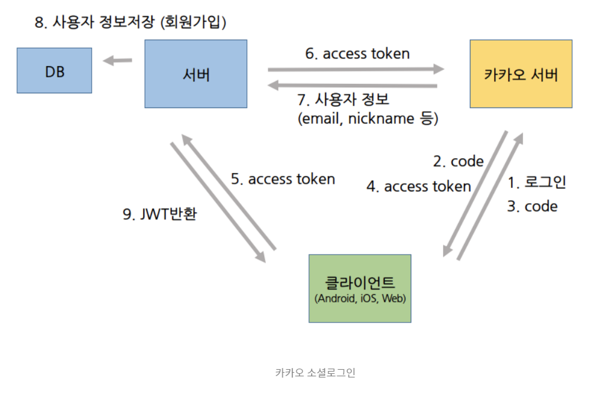

https://suyeoniii.tistory.com/79


내 앱 -> REST API 키 사용


### Redirect URI

카카오 로그인을 수행했을 때 발급되는 code를 반환할 페이지


### 동의항목 설정

필수, 선택 설정 (email 선택으로 설정함)


서비스 서버는 `redirect_uri`로 HTTP 302 리다이렉트된 요청의 `Location`에서 인가 코드 또는 에러를 확인해 다음과 같이 처리해야 합니다.

- 인가 코드 받기 요청 성공
  - `code` 및 `state`가 전달된 경우
  - `code`의 인가 코드 값으로 [토큰 받기](https://developers.kakao.com/docs/latest/ko/kakaologin/rest-api#request-token) 요청
- 인가 코드 받기 요청 실패
  - `error` 및 `error_description`이 전달된 경우
  - [문제 해결](https://developers.kakao.com/docs/latest/ko/kakaologin/trouble-shooting), [응답 코드](https://developers.kakao.com/docs/latest/ko/reference/rest-api-reference#response-code)를 참고해 에러 원인별 상황에 맞는 서비스 페이지나 안내 문구를 사용자에게 보여주도록 처리


### 로그인

아래 url로 접속

```xml
kauth.kakao.com/oauth/authorize?client_id={REST_API_KEY}&redirect_uri={REDIRECT_URI}&response_type=code
```

redirect_uri = http://localhost:5000/oauth/kakao


GET /oauth/authorize?client_id=${REST_API_KEY}&redirect_uri=${REDIRECT_URI}&response_type=code HTTP/1.1 Host: kauth.kakao.com


아까 설정한 localhost:9000/oauth/kakao로 redirect되었고, **Query String**으로 **code**를 받는다.


https://suyeoniii.tistory.com/79

https://notspoon.tistory.com/36

https://blerang055.tistory.com/3

https://riimy.tistory.com/62

https://ronaldocfg.tistory.com/8

[끝판왕] https://deeplify.dev/back-end/spring/oauth2-social-login#%EC%B9%B4%EC%B9%B4%EC%98%A4-oauth-%EC%84%9C%EB%B9%84%EC%8A%A4-%EB%93%B1%EB%A1%9D


보안 코드값

riKZOBeEYWzWDVfGSijnZgXi2wgDX4Sp