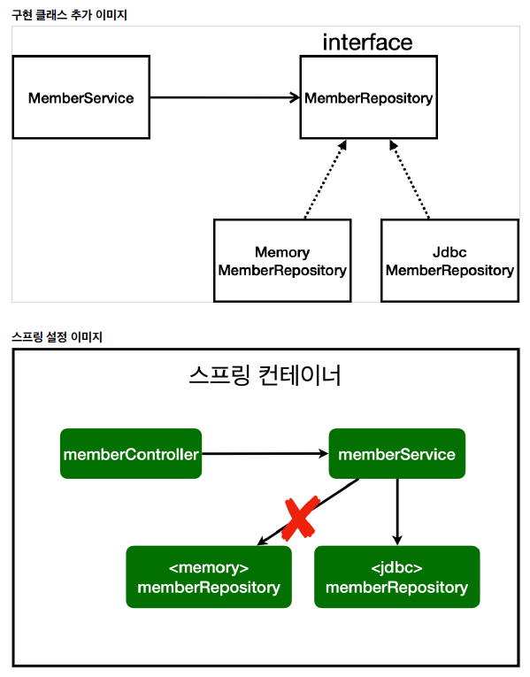

## 회원 관리 예제

### 회원 웹 기능 - 홈 화면 추가

### 회원 웹 기능 - 조회

* 개방-폐쇄 원칙(OCP, Open-Close principle)
  * 확장에는 열려있고, 수정, 변경에는 닫혀 있음
* 스프링의 DI(Dependencies Injection)을 사용하면 기존 코드를 전혀 손대지 않고, 설정만으로 구한 클래스를 변경할 수 있음
* 회원을 등록하고 DB에 결과가 잘 입력되는지 확인
* 데이터를 DB에 저장하므로 스프링 서버를 다시 실행해도 데이터가 안전하게 저장됨

## 스프링 통합 테스트

@SpringBootTest : 스프링 컨테이너와 테스트를 함께 실행

@Transactional : 테스트 케이스에 이 이노테이션이 있으면, 테스트 시작 전에 트랜잭션을 시작하고, 테스트 완료 후에 항상 롤백함.

이렇게 하면 DB에 데이터가 남아 다음 테스트에 영향X

## Spring JdbcTemplate

순수 Jdbc와 동일한 환경설정

스프링 JdbcTemplate과 MyBatis 같은 라이브러리는 JDBC API에서 본 반복 코드를 대부분 제거해줌

but SQL문은 직접 작성해야 함

## JPA

기존의 반복 코드는 물론이고 기본적인 SQL도 JPA가 직접 만들어서 실행

SQL과 데이터 중심의 설게에서 객체 중심의 설계로 패러다임 전환

개발 생산성 크게 높일 수 있음

