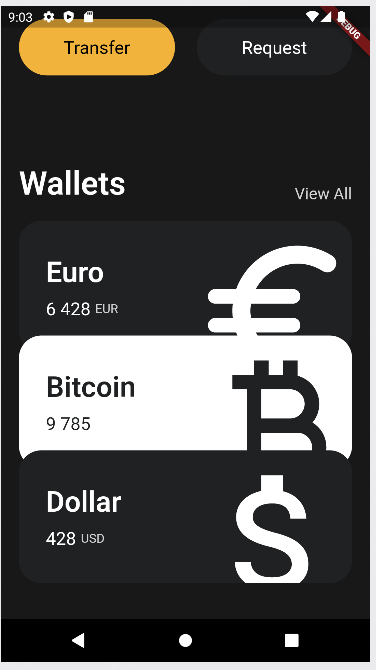
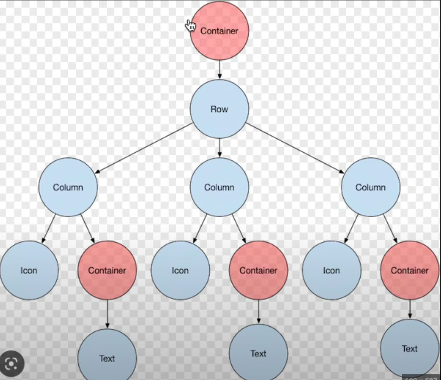
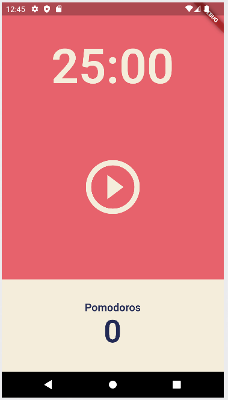
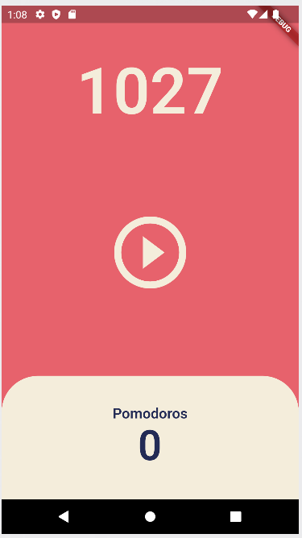
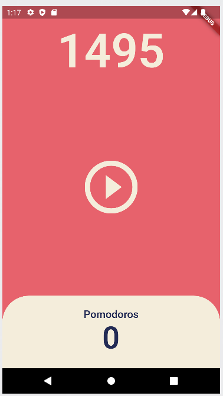
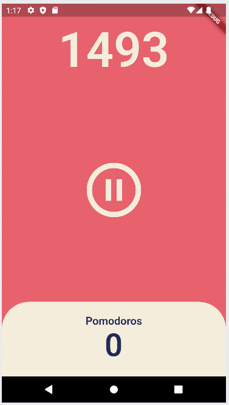
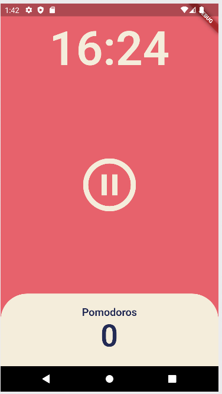
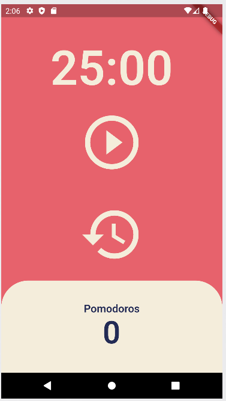

## Header


```dart
class App extends StatelessWidget {
  @override
  Widget build(BuildContext context) {
    return MaterialApp(
      // 기본적인 material design의 시각적인 레이아웃 구조
      home: Scaffold(
          // 배경색 지정
          backgroundColor: Color(0xFF181818),
          // body
          // padding : 여백, padding 필요
          body: Padding(
            // 필수, symmetric은 수평 조절할 수 있음, child
            padding: EdgeInsets.symmetric(horizontal: 40),
            // Column : children 필요
            child: Column(
              children: [
                // 빈 박스
                SizedBox(
                  height: 80,
                ),
                // Column 내의 수평 요소
                Row(
                  // 제일 오른쪽으로 정렬
                  mainAxisAlignment: MainAxisAlignment.end,
                  // Row의 children으로 Column을 갖고 Text * 2
                  children: [
                    Column(
                      // 제일 오른쪽으로 정렬
                      crossAxisAlignment: CrossAxisAlignment.end,
                      children: [
                        Text(
                          'Hey, SeungHwan',
                          style: TextStyle(
                            color: Colors.white,
                            fontSize: 28,
                            fontWeight: FontWeight.w800,
                          ),
                        ),
                        Text(
                          'Welcome back',
                          style: TextStyle(
                            color: Colors.white.withOpacity(0.8),
                            fontSize: 18,
                          ),
                        ),
                      ],
                    )
                  ],
                ),
              ],
            ),
          )),
    );
  }
}
```


## Developer Tools


Devtool로 layout과 구조들을 파악할 수 있음


## Buttons Section


```dart
import 'package:flutter/material.dart';

class Player {
  String? name;

  Player({required this.name});
}

void main() {
  var son = Player(name: "son");
  son.name;
  runApp(App());
}

class App extends StatelessWidget {
  @override
  Widget build(BuildContext context) {
    return MaterialApp(
      home: Scaffold(
          backgroundColor: Color(0xFF181818),
          body: Padding(
            padding: EdgeInsets.symmetric(horizontal: 40),
            child: Column(
              crossAxisAlignment: CrossAxisAlignment.start,
              children: [
                SizedBox(
                  height: 80,
                ),
                Row(
                  mainAxisAlignment: MainAxisAlignment.end,
                  children: [
                    Column(
                      crossAxisAlignment: CrossAxisAlignment.end,
                      children: [
                        Text(
                          'Hey, SeungHwan',
                          style: TextStyle(
                            color: Colors.white,
                            fontSize: 28,
                            fontWeight: FontWeight.w800,
                          ),
                        ),
                        Text(
                          'Welcome back',
                          style: TextStyle(
                            color: Color.fromRGBO(255, 255, 255, 0.8),
                            fontSize: 18,
                          ),
                        ),
                      ],
                    )
                  ],
                ),
                SizedBox(
                  height: 120,
                ),
                Text(
                  'Total Balance',
                  style: TextStyle(
                    fontSize: 22,
                    color: Colors.white.withOpacity(0.8),
                  ),
                ),
                SizedBox(
                  height: 10,
                ),
                Text(
                  '\$5 194 482',
                  style: TextStyle(
                    fontSize: 48,
                    fontWeight: FontWeight.w600,
                    color: Colors.white,
                  ),
                ),
                SizedBox(
                  height: 30,
                ),
                // 버튼 생성을 위한 새로운 Row 추가
                Row(
                  children: [
                    // Box를 담을 Container 생성
                    Container(
                        // 데코
                        decoration: BoxDecoration(
                          color: Colors.amber,
                          // 테두리
                          borderRadius: BorderRadius.circular(45),
                        ),
                        // 내용 설정
                        child: Padding(
                          padding: EdgeInsets.symmetric(
                            vertical: 20,
                            horizontal: 50,
                          ),
                          child: Text('Transfer',
                              style: TextStyle(
                                fontSize: 20,
                              )),
                        )),
                  ],
                )
              ],
            ),
          )),
    );
  }
}
```


## VSCode Settings

settings.json 에서

```dart
"editor.codeActionsOnSave": {
"source.fixAll": true
}
```

추가함으로써 일일히 const 지정 안해줘도 됨

```dart
"dart.previewFlutterUiGuides": true
```

추가해서 가이드 라인 볼 수 있음, 보기 편해짐


## Code Actions

전구로 요소를 자동으로 감쌀 수 있음

벗길수도 있음

이동도 가능

복붙을 하면서 실수 할 수 있는 것 방지, 훨씬 간편해짐

```
"[dart]": {
        "editor.formatOnSave": true, // 자동정렬해줌
        "editor.formatOnType": true,
        "editor.rulers": [
            80
        ],
        "editor.selectionHighlight": false,
        "editor.suggest.snippetsPreventQuickSuggestions": false,
        "editor.suggestSelection": "first",
        "editor.tabCompletion": "onlySnippets",
        "editor.wordBasedSuggestions": false
    },
```


## Reusable Widgets


버튼(code action) 크기가 화면을 넘어갈땐 화면에서 알려줌

extract해서 커스텀 위젯으로 만들 수 있음


### lib/widgets/button.dart

```dart
import 'package:flutter/material.dart';

class Button extends StatelessWidget {
  final String text;
  final Color bgColor;
  final Color textColor;

  const Button(
      {super.key,
      required this.text,
      required this.bgColor,
      required this.textColor});

  @override
  Widget build(BuildContext context) {
    return Container(
      decoration: BoxDecoration(
        color: bgColor,
        borderRadius: BorderRadius.circular(45),
      ),
      child: Padding(
        padding: const EdgeInsets.symmetric(
          vertical: 20,
          horizontal: 50,
        ),
        child: Text(
          text,
          style: TextStyle(
            color: textColor,
            fontSize: 20,
          ),
        ),
      ),
    );
  }
}
```

커스텀 버튼 클래스를 만들어서 사용할 수 있음

code action으로 자동으로 생성할 수 도 있지만 아직은 직접 해보기

parameter 입력하도록 할 수 도 있음


```dart
import 'package:flutter/material.dart';
import 'package:toonflix/widgets/button.dart';


Row(
    mainAxisAlignment: MainAxisAlignment.spaceBetween,
    children: const [
        Button(
            text: 'Transfer',
            bgColor: Color(0xFFF1B33B),
            textColor: Colors.black,
        ),
        Button(
            text: 'Request',
            bgColor: Color(0xFF1F2123),
            textColor: Colors.white,
        ),
    ],
)
```

custom한 class를 간편하게 reuse 가능


## Cards


아래로 넘어가면 화면을 SingleChildScrollView로 감싸서 스크롤하게 할 수 있음


## Icons and Transforms

```dart
Container(
    // 칸 넘어갈 때 어떡할지 설정 가능
    clipBehavior: Clip.hardEdge,
    decoration: BoxDecoration(
        color: const Color(0xFF1F2123),
        borderRadius: BorderRadius.circular(25),
    ),
    child: Padding(
        padding: const EdgeInsets.all(30),
        child: Row(
            mainAxisAlignment: MainAxisAlignment.spaceBetween,
            children: [
                Column(
                    crossAxisAlignment: CrossAxisAlignment.start,
                    children: [
                        const Text(
                            'Euro',
                            style: TextStyle(
                                color: Colors.white,
                                fontSize: 32,
                                fontWeight: FontWeight.w600,
                            ),
                        ),
                        const SizedBox(
                            height: 10,
                        ),
                        Row(
                            children: [
                                const Text(
                                    '6 428',
                                    style: TextStyle(
                                        color: Colors.white,
                                        fontSize: 20,
                                    ),
                                ),
                                const SizedBox(
                                    width: 5,
                                ),
                                Text(
                                    'EUR',
                                    style: TextStyle(
                                        color: Colors.white.withOpacity(0.8),
                                    ),
                                ),
                            ],
                        )
                    ],
                ),
                // 몇배 커지게 할지 가능
                Transform.scale(
                    scale: 2.2,
                    // offset 포함
                    child: Transform.translate(
                        // x, y 방향으로 얼마나 움직일지 설정 가능
                        offset: const Offset(-5, 12),
                        // Icon 삽입 가능
                        child: const Icon(
                            Icons.euro_rounded,
                            color: Colors.white,
                            size: 88,
                        ),
                    ),
                ),
            ],
        ),
    ),
)
```


## Reusable Cards



```dart
Transform.translate(
    offset: const Offset(0, -20),
    child: const CurrencyCard(
        name: 'Bitcoin',
        code: 'BTC',
        amount: '9 785',
        icon: Icons.currency_bitcoin,
        isInverted: true,
    ),
),
Transform.translate(
    offset: const Offset(0, -40),
    child: const CurrencyCard(
        name: 'Dollar',
        code: 'USD',
        amount: '428',
        icon: Icons.attach_money_outlined,
        isInverted: false,
    ),
),
```


Transform.translate으로 감싸기


## Code Challenge


## 4 0 State

convert to StatefulWidget


Stateful Widget => Dart 클래스 프로퍼티

State => 우리가 UI 구축하는 곳


## 4 1 setState

setState는 State클래스에게 데이터가 변경됐다고 알려줌

setState는 기본적으로 새로운 데이터와 함꼐 state를 다시 한번 부름


그럼 데이터를 무조건 setState 안에 넣어야함? 꼭 그럴 필요는 없음

근데 안에 넣는게 좋긴함, 가독성 상승

setState를 호출할 때 마다 새로운 데이터를 UI에 반영해서 위젯을 만듬

```dart
import 'package:flutter/material.dart';

void main() {
  runApp(App());
}

class App extends StatefulWidget {
  @override
  State<App> createState() => _AppState();
}

class _AppState extends State<App> {
  int counter = 0;

  void onClicked() {
    setState(() {
      counter = counter + 1;
    });
  }

  @override
  Widget build(BuildContext context) {
    return MaterialApp(
      home: Scaffold(
        backgroundColor: const Color(0xFFF4EDDB),
        body: Center(
          child: Column(
            mainAxisAlignment: MainAxisAlignment.center,
            children: [
              const Text(
                'Click Count',
                style: TextStyle(fontSize: 30),
              ),
              Text(
                '$counter',
                style: const TextStyle(fontSize: 30),
              ),
              IconButton(
                iconSize: 40,
                onPressed: onClicked,
                icon: const Icon(
                  Icons.add_box_rounded,
                ),
              )
            ],
          ),
        ),
      ),
    );
  }
}
```


## Recap

counter는 Dart의 클래스 프로퍼티일 뿐

setState를 호출하지 않으면 데이터는 변경되는데 UI는 변경되지 않음 => 오히려 이런 상황을 이용할 수 있음

flutter에게 build method를 다시 실행시켜달라고 하고 싶을 때 setState

반드시 setState안에 데이터 업데이트를 배치할 필요는 없지만 권장(가독성 상승)


## 3 3 BuildContext




theme에 데이터를 저장하고 아주 먼 MyLargeTitle 위젯에 BuildContext를 통해 접근할 수 있음

```dart
import 'package:flutter/material.dart';

void main() {
  runApp(App());
}

class App extends StatefulWidget {
  @override
  State<App> createState() => _AppState();
}

class _AppState extends State<App> {
  @override
  Widget build(BuildContext context) {
    return MaterialApp(
      // theme에 style을 미리 저장해 둘 수 있음
      theme: ThemeData(
        textTheme: const TextTheme(
          titleLarge: TextStyle(
            color: Colors.red,
          ),
        ),
      ),
      home: Scaffold(
        backgroundColor: const Color(0xFFF4EDDB),
        body: Center(
          child: Column(
            mainAxisAlignment: MainAxisAlignment.center,
            children: const [
              MyLargeTitle(),
            ],
          ),
        ),
      ),
    );
  }
}

class MyLargeTitle extends StatelessWidget {
  const MyLargeTitle({
    Key? key,
  }) : super(key: key);

  @override
  // BuildContext를 통해 상위 클래스의 theme에 접근할 수 있음
  Widget build(BuildContext context) {
    return Text(
      'My Large Title',
      style: TextStyle(
        fontSize: 30,
        color: Theme.of(context).textTheme.titleLarge?.color,
      ),
    );
  }
}

```


## 3 4 Widget Lifecylce

initState는 대부분 필요 없지만 종종 부모 요소에 의존하는 데이터를 초기해야하는 상황

가끔 데이터를 초기화하기 위해 context를 상요할 것임

api에서 업데이트를 구독

해야하는 상황에 항상 initState 메서드가 build 메서드 전에 한번 호출 돼야함

super.initState() 호출 해야함


initState는 항상 buildState전에 생성 됨


dipsose :  사라질 때, 뭔가를 취소할 때 위젯이 위젯 트리에서 제거되기 전에 무언가를 취소하고 싶을 때


stateful widget은 lifecycle이 있음

=> initState, build, dispose


## 4 0 User Interface

### main.dart

```dart
import 'package:flutter/material.dart';
import 'package:toonflix2/screens/home_screen.dart';

void main() {
  runApp(App());
}

class App extends StatelessWidget {
  @override
  Widget build(BuildContext context) {
    return MaterialApp(
      theme: ThemeData(
        backgroundColor: const Color(0xFFE7626C),
        textTheme: const TextTheme(
          headline1: TextStyle(
            color: Color(0xFF232B55),
          ),
        ),
        cardColor: const Color(0xFFF4EDDB),
      ),
      home: const HomeScreen(),
    );
  }
}
```

HomeScreen 클래스 따로 만들어서 메인에서 불러오기

### lib/home_screens.dart

```dart
import 'package:flutter/material.dart';

class HomeScreen extends StatefulWidget {
  const HomeScreen({super.key});

  @override
  State<HomeScreen> createState() => _HomeScreenState();
}

class _HomeScreenState extends State<HomeScreen> {
  @override
  Widget build(BuildContext context) {
    return Scaffold(
      backgroundColor: Theme.of(context).backgroundColor,
      body: Column(
        children: [
          Flexible(
            flex: 1,
            child: Container(
              alignment: Alignment.bottomCenter,
              child: Text(
                '25:00',
                style: TextStyle(
                  color: Theme.of(context).cardColor,
                  fontSize: 89,
                  fontWeight: FontWeight.w600,
                ),
              ),
            ),
          ),
          Flexible(
            flex: 2,
            child: Center(
              child: IconButton(
                iconSize: 120,
                color: Theme.of(context).cardColor,
                onPressed: () {},
                icon: const Icon(
                  Icons.play_circle_outline,
                ),
              ),
            ),
          ),
          Flexible(
            flex: 1,
            child: Row(
              children: [
                Expanded(
                  child: Container(
                    decoration:
                        BoxDecoration(color: Theme.of(context).cardColor),
                    child: Column(
                      mainAxisAlignment: MainAxisAlignment.center,
                      children: [
                        Text(
                          'Pomodoros',
                          style: TextStyle(
                            fontSize: 20,
                            fontWeight: FontWeight.w600,
                            color: Theme.of(context).textTheme.headline1!.color,
                          ),
                        ),
                        Text(
                          '0',
                          style: TextStyle(
                            fontSize: 58,
                            fontWeight: FontWeight.w600,
                            color: Theme.of(context).textTheme.headline1!.color,
                          ),
                        ),
                      ],
                    ),
                  ),
                ),
              ],
            ),
          ),
        ],
      ),
    );
  }
}
```

Flexible : 화면 비율에 맞춰서 크기 조절 가능





## 4 1 Timer

```dart
int totalSeconds = 1500;
late Timer timer;

void onTick(Timer timer) {
    setState(() {
        totalSeconds = totalSeconds - 1;
    });
}

// 버튼 클릭시 타이머 실행
void onStartPressed() {
    // 내장 Timer
    timer = Timer.periodic(
        // 시간 간격, 초, 분 등등
        const Duration(seconds: 1),
        // 시간 함수 넣어야하는데 onTick 정의해서 전체 시간에서 1씩 빠지게
        onTick,
    );
}
```




## 4 2 Pause Play

```dart
void onPuasePressed() {
    timer.cancel();
    setState(() {
        isRunning = false;
    });
}

Flexible(
    flex: 3,
    child: Center(
        child: IconButton(
            iconSize: 120,
            color: Theme.of(context).cardColor,
            // isRunning이 true 이면 onPuasePressed 실행
            // false 이면 onStartPressed 실행
            onPressed: isRunning ? onPuasePressed : onStartPressed,
            icon: Icon(
                // isRunning의 값에 따라 Icon도 재생과 정지로 변경
                isRunning
                ? Icons.pause_circle_outline
                : Icons.play_circle_outline,
            ),
        ),
    ),
),
```





## 4 3 Date Format

```dart
void onPuasePressed() {
    timer.cancel();
    setState(() {
        isRunning = false;
    });
}
// 시간 디자인을 위해 format 함수 정의, input값은 totalSeconds를 넣을 것임
String format(int seconds) {
    // 초를 시간으로 바꿔서
    var duration = Duration(seconds: seconds);
    // 문자로 바꾼 후 . 기준으로 뒤에 날리고 앞 문자열 중 2~7까지 반환
    return duration.toString().split(".").first.substring(2, 7);
}
```




## 4 4 Code Challenge

```dart
import 'dart:async';

import 'package:flutter/material.dart';

class HomeScreen extends StatefulWidget {
  const HomeScreen({super.key});

  @override
  State<HomeScreen> createState() => _HomeScreenState();
}

class _HomeScreenState extends State<HomeScreen> {
  static const twentyFiveMinutes = 1500;
  int totalSeconds = twentyFiveMinutes;
  bool isRunning = false;
  late Timer timer;
  int totalPomodoros = 0;

  void onTick(Timer timer) {
    if (totalSeconds == 0) {
      setState(() {
        totalPomodoros = totalPomodoros + 1;
        isRunning = false;
        totalSeconds = twentyFiveMinutes;
      });
      timer.cancel();
    } else {
      setState(() {
        totalSeconds = totalSeconds - 1;
      });
    }
  }

  void onStartPressed() {
    timer = Timer.periodic(
      const Duration(seconds: 1),
      onTick,
    );
    setState(() {
      isRunning = true;
    });
  }

  void onPuasePressed() {
    timer.cancel();
    setState(() {
      isRunning = false;
    });
  }

  void onResetPressed() {
    timer.cancel();
    setState(() {
      isRunning = false;
      totalSeconds = twentyFiveMinutes;
    });
  }

  String format(int seconds) {
    var duration = Duration(seconds: seconds);
    return duration.toString().split(".").first.substring(2, 7);
  }

  @override
  Widget build(BuildContext context) {
    return Scaffold(
      backgroundColor: Theme.of(context).backgroundColor,
      body: Column(
        children: [
          Flexible(
            flex: 1,
            child: Container(
              alignment: Alignment.bottomCenter,
              child: Text(
                format(totalSeconds),
                style: TextStyle(
                  color: Theme.of(context).cardColor,
                  fontSize: 89,
                  fontWeight: FontWeight.w600,
                ),
              ),
            ),
          ),
          Flexible(
            flex: 1,
            child: Center(
              child: IconButton(
                iconSize: 120,
                color: Theme.of(context).cardColor,
                onPressed: isRunning ? onPuasePressed : onStartPressed,
                icon: Icon(
                  isRunning
                      ? Icons.pause_circle_outline
                      : Icons.play_circle_outline,
                ),
              ),
            ),
          ),
          Flexible(
            flex: 1,
            child: Center(
              child: IconButton(
                iconSize: 120,
                color: Theme.of(context).cardColor,
                onPressed: onResetPressed,
                icon: const Icon(Icons.history),
              ),
            ),
          ),
          Flexible(
            flex: 1,
            child: Row(
              children: [
                Expanded(
                  child: Container(
                    decoration: BoxDecoration(
                      color: Theme.of(context).cardColor,
                      borderRadius: const BorderRadius.only(
                        topLeft: Radius.circular(50),
                        topRight: Radius.circular(50),
                      ),
                    ),
                    child: Column(
                      mainAxisAlignment: MainAxisAlignment.center,
                      children: [
                        Text(
                          'Pomodoros',
                          style: TextStyle(
                            fontSize: 20,
                            fontWeight: FontWeight.w600,
                            color: Theme.of(context).textTheme.headline1!.color,
                          ),
                        ),
                        Text(
                          '$totalPomodoros',
                          style: TextStyle(
                            fontSize: 58,
                            fontWeight: FontWeight.w600,
                            color: Theme.of(context).textTheme.headline1!.color,
                          ),
                        ),
                      ],
                    ),
                  ),
                ),
              ],
            ),
          ),
        ],
      ),
    );
  }
}
```


