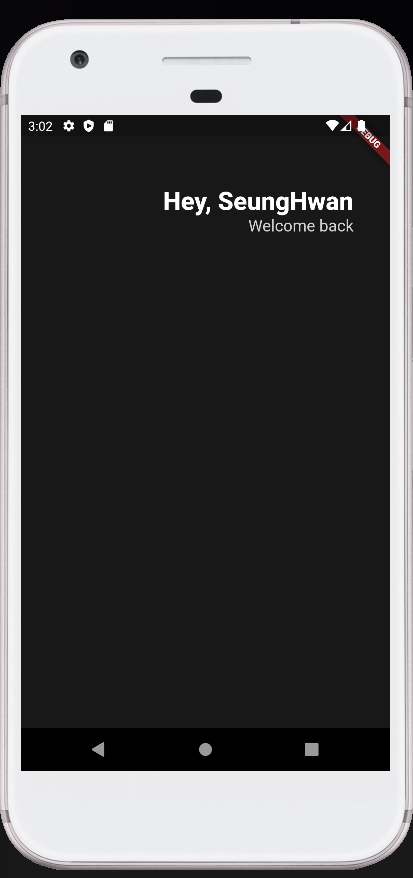
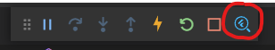
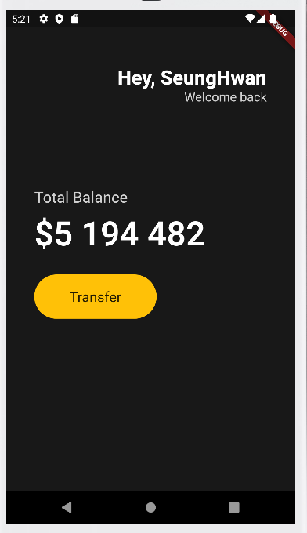
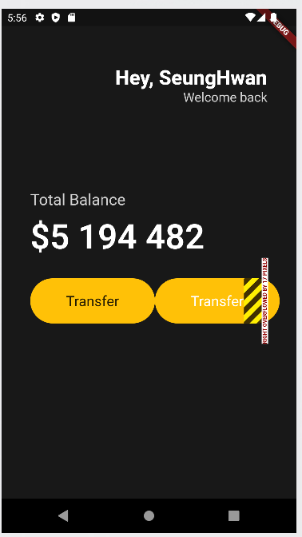
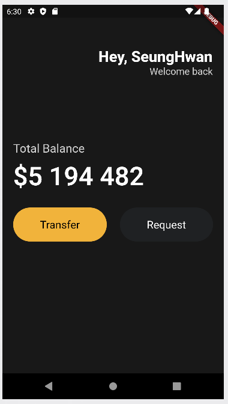
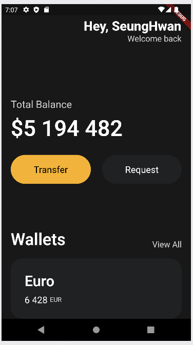
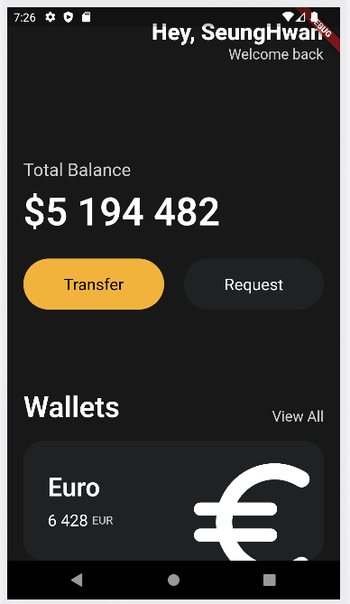

## Header



```dart
class App extends StatelessWidget {
  @override
  Widget build(BuildContext context) {
    return MaterialApp(
      // 기본적인 material design의 시각적인 레이아웃 구조
      home: Scaffold(
          // 배경색 지정
          backgroundColor: Color(0xFF181818),
          // body
          // padding : 여백, padding 필요
          body: Padding(
            // 필수, symmetric은 수평 조절할 수 있음, child
            padding: EdgeInsets.symmetric(horizontal: 40),
            // Column : children 필요
            child: Column(
              children: [
                // 빈 박스
                SizedBox(
                  height: 80,
                ),
                // Column 내의 수평 요소
                Row(
                  // 제일 오른쪽으로 정렬
                  mainAxisAlignment: MainAxisAlignment.end,
                  // Row의 children으로 Column을 갖고 Text * 2
                  children: [
                    Column(
                      // 제일 오른쪽으로 정렬
                      crossAxisAlignment: CrossAxisAlignment.end,
                      children: [
                        Text(
                          'Hey, SeungHwan',
                          style: TextStyle(
                            color: Colors.white,
                            fontSize: 28,
                            fontWeight: FontWeight.w800,
                          ),
                        ),
                        Text(
                          'Welcome back',
                          style: TextStyle(
                            color: Colors.white.withOpacity(0.8),
                            fontSize: 18,
                          ),
                        ),
                      ],
                    )
                  ],
                ),
              ],
            ),
          )),
    );
  }
}
```


## Developer Tools



Devtool로 layout과 구조들을 파악할 수 있음


## Buttons Section



```dart
import 'package:flutter/material.dart';

class Player {
  String? name;

  Player({required this.name});
}

void main() {
  var son = Player(name: "son");
  son.name;
  runApp(App());
}

class App extends StatelessWidget {
  @override
  Widget build(BuildContext context) {
    return MaterialApp(
      home: Scaffold(
          backgroundColor: Color(0xFF181818),
          body: Padding(
            padding: EdgeInsets.symmetric(horizontal: 40),
            child: Column(
              crossAxisAlignment: CrossAxisAlignment.start,
              children: [
                SizedBox(
                  height: 80,
                ),
                Row(
                  mainAxisAlignment: MainAxisAlignment.end,
                  children: [
                    Column(
                      crossAxisAlignment: CrossAxisAlignment.end,
                      children: [
                        Text(
                          'Hey, SeungHwan',
                          style: TextStyle(
                            color: Colors.white,
                            fontSize: 28,
                            fontWeight: FontWeight.w800,
                          ),
                        ),
                        Text(
                          'Welcome back',
                          style: TextStyle(
                            color: Color.fromRGBO(255, 255, 255, 0.8),
                            fontSize: 18,
                          ),
                        ),
                      ],
                    )
                  ],
                ),
                SizedBox(
                  height: 120,
                ),
                Text(
                  'Total Balance',
                  style: TextStyle(
                    fontSize: 22,
                    color: Colors.white.withOpacity(0.8),
                  ),
                ),
                SizedBox(
                  height: 10,
                ),
                Text(
                  '\$5 194 482',
                  style: TextStyle(
                    fontSize: 48,
                    fontWeight: FontWeight.w600,
                    color: Colors.white,
                  ),
                ),
                SizedBox(
                  height: 30,
                ),
                // 버튼 생성을 위한 새로운 Row 추가
                Row(
                  children: [
                    // Box를 담을 Container 생성
                    Container(
                        // 데코
                        decoration: BoxDecoration(
                          color: Colors.amber,
                          // 테두리
                          borderRadius: BorderRadius.circular(45),
                        ),
                        // 내용 설정
                        child: Padding(
                          padding: EdgeInsets.symmetric(
                            vertical: 20,
                            horizontal: 50,
                          ),
                          child: Text('Transfer',
                              style: TextStyle(
                                fontSize: 20,
                              )),
                        )),
                  ],
                )
              ],
            ),
          )),
    );
  }
}
```


## VSCode Settings

settings.json 에서

```dart
"editor.codeActionsOnSave": {
"source.fixAll": true
}
```

추가함으로써 일일히 const 지정 안해줘도 됨

```dart
"dart.previewFlutterUiGuides": true
```

추가해서 가이드 라인 볼 수 있음, 보기 편해짐


## Code Actions

전구로 요소를 자동으로 감쌀 수 있음

벗길수도 있음

이동도 가능

복붙을 하면서 실수 할 수 있는 것 방지, 훨씬 간편해짐

```
"[dart]": {
        "editor.formatOnSave": true, // 자동정렬해줌
        "editor.formatOnType": true,
        "editor.rulers": [
            80
        ],
        "editor.selectionHighlight": false,
        "editor.suggest.snippetsPreventQuickSuggestions": false,
        "editor.suggestSelection": "first",
        "editor.tabCompletion": "onlySnippets",
        "editor.wordBasedSuggestions": false
    },
```


## Reusable Widgets



버튼(code action) 크기가 화면을 넘어갈땐 화면에서 알려줌

extract해서 커스텀 위젯으로 만들 수 있음


### lib/widgets/button.dart

```dart
import 'package:flutter/material.dart';

class Button extends StatelessWidget {
  final String text;
  final Color bgColor;
  final Color textColor;

  const Button(
      {super.key,
      required this.text,
      required this.bgColor,
      required this.textColor});

  @override
  Widget build(BuildContext context) {
    return Container(
      decoration: BoxDecoration(
        color: bgColor,
        borderRadius: BorderRadius.circular(45),
      ),
      child: Padding(
        padding: const EdgeInsets.symmetric(
          vertical: 20,
          horizontal: 50,
        ),
        child: Text(
          text,
          style: TextStyle(
            color: textColor,
            fontSize: 20,
          ),
        ),
      ),
    );
  }
}
```

커스텀 버튼 클래스를 만들어서 사용할 수 있음

code action으로 자동으로 생성할 수 도 있지만 아직은 직접 해보기

parameter 입력하도록 할 수 도 있음


```dart
import 'package:flutter/material.dart';
import 'package:toonflix/widgets/button.dart';


Row(
    mainAxisAlignment: MainAxisAlignment.spaceBetween,
    children: const [
        Button(
            text: 'Transfer',
            bgColor: Color(0xFFF1B33B),
            textColor: Colors.black,
        ),
        Button(
            text: 'Request',
            bgColor: Color(0xFF1F2123),
            textColor: Colors.white,
        ),
    ],
)
```

custom한 class를 간편하게 reuse 가능




## Cards



아래로 넘어가면 화면을 SingleChildScrollView로 감싸서 스크롤하게 할 수 있음


## Icons and Transforms

```dart
Container(
    // 칸 넘어갈 때 어떡할지 설정 가능
    clipBehavior: Clip.hardEdge,
    decoration: BoxDecoration(
        color: const Color(0xFF1F2123),
        borderRadius: BorderRadius.circular(25),
    ),
    child: Padding(
        padding: const EdgeInsets.all(30),
        child: Row(
            mainAxisAlignment: MainAxisAlignment.spaceBetween,
            children: [
                Column(
                    crossAxisAlignment: CrossAxisAlignment.start,
                    children: [
                        const Text(
                            'Euro',
                            style: TextStyle(
                                color: Colors.white,
                                fontSize: 32,
                                fontWeight: FontWeight.w600,
                            ),
                        ),
                        const SizedBox(
                            height: 10,
                        ),
                        Row(
                            children: [
                                const Text(
                                    '6 428',
                                    style: TextStyle(
                                        color: Colors.white,
                                        fontSize: 20,
                                    ),
                                ),
                                const SizedBox(
                                    width: 5,
                                ),
                                Text(
                                    'EUR',
                                    style: TextStyle(
                                        color: Colors.white.withOpacity(0.8),
                                    ),
                                ),
                            ],
                        )
                    ],
                ),
                // 몇배 커지게 할지 가능
                Transform.scale(
                    scale: 2.2,
                    // offset 포함
                    child: Transform.translate(
                        // x, y 방향으로 얼마나 움직일지 설정 가능
                        offset: const Offset(-5, 12),
                        // Icon 삽입 가능
                        child: const Icon(
                            Icons.euro_rounded,
                            color: Colors.white,
                            size: 88,
                        ),
                    ),
                ),
            ],
        ),
    ),
)
```




## Reusable Cards

