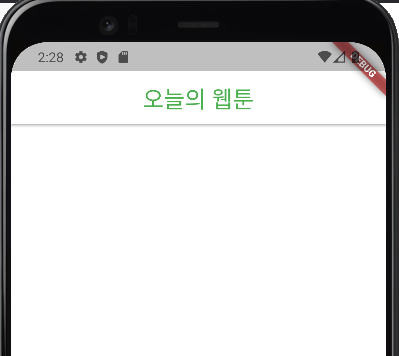
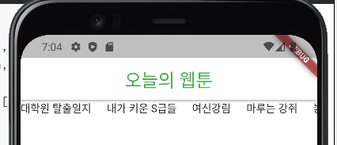
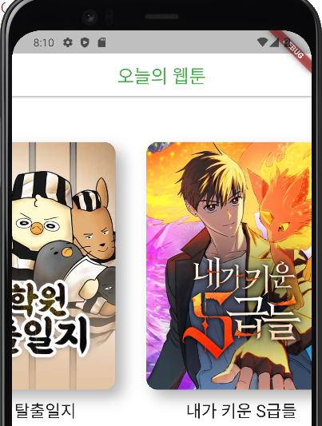
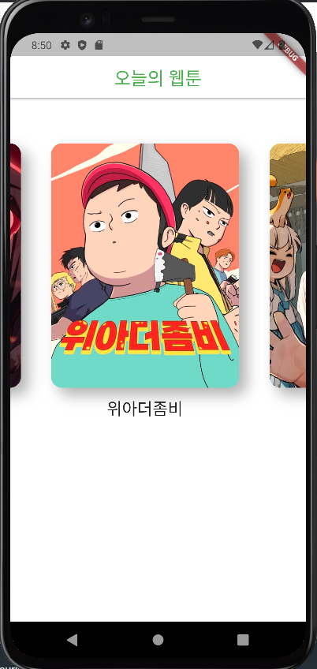
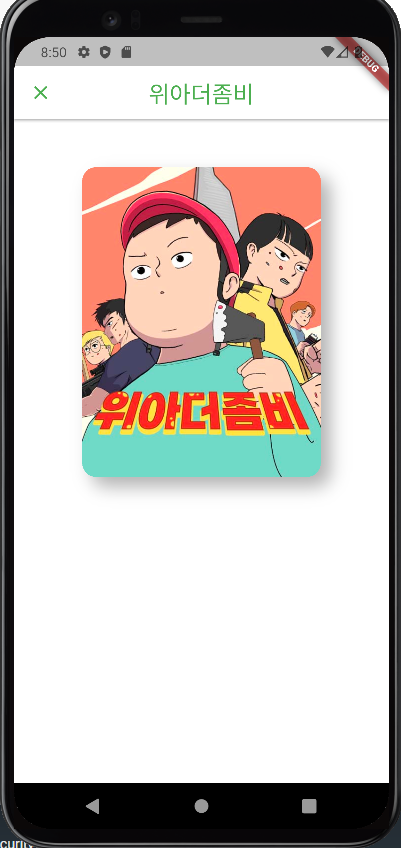

## 1. AppBar

### lib/screens/home_screens.dart

```dart
import 'package:flutter/material.dart';

class HomeScreen extends StatelessWidget {
  const HomeScreen({super.key});

  @override
  Widget build(BuildContext context) {
    return Scaffold(
      // Scaffold 배경색
      backgroundColor: Colors.white,
      appBar: AppBar(
        // appBar의 음영 설정
        elevation: 2,
        // appBar의 앞 글자 색 변경
        foregroundColor: Colors.green,
        // appBar의 배경색 변경
        backgroundColor: Colors.white,
        centerTitle: true,
        title: const Text(
          "오늘의 웹툰",
          style: TextStyle(
            fontSize: 24,
          ),
        ),
      ),
    );
  }
}
```


### problems

* emulator 연결
  * 어제까지만 해도 잘 되던 기기의 emulator가 갑자기 연결이 되지 않았음
* 해결 방법
  * emulator를 다시 다운 받았음


* home_screen과 main.dart의 연결

  * main.dart의 home을 HomeScreen()으로 맞춰 homescreen 클래스를 잘 찾을 수 있도록 해줌

  




## 2. Data Fetching

### 패키지 설치

1. pub.dev에서 원하는 패키지 검색
2. dart / flutter / dependencies 중 선택해서 설치


#### pubspec.yaml

프로젝트에 대한 정보를 담고 있음

dependencies에 pub.dev에서 링크를 복붙해 저장하면 자동으로 설치가 됨


Future은 미래에 받을 결과 값임을 알려줌, 끝나면 Response를 알려줌

await은 asynchronous function(비동기 함수)내에세만 사용될 수 있음

await 후에는 완료 되었기 때문에 반환된 응답은 response만 존재

```dart
import 'package:http/http.dart' as http;

class ApiService {
  final String baseUrl = "https://webtoon-crawler.nomadcoders.workers.dev";
  final String today = "today";
  // asyn 안에서만 await 사용 가능
  void getTodaysToons() async {
    final url = Uri.parse('$baseUrl/$today');
    final response = await http.get(url);
    // response가 200일 때만 print
    if (response.statusCode == 200) {
      print(response.body);
      return;
    }
    // 예외 처리
    throw Error();
  }
}
```


## 3. fromJson

텍스트를 클래스로 변환해야함

클래스로 이루어진 리스트로 반환

### lib/models/webtoon_model.dart

```dart
class WebtoonModel {
  final String title, thumb, id;
  // named
  WebtoonModel.fromJson(Map<String, dynamic> json)
      : title = json['title'],
        thumb = json['thumb'],
        id = json['id'];
}
```


### lib/services/api_service.dart

```dart
import 'dart:convert';
import 'package:toonflix3/models/webtoon_model.dart';
import 'package:http/http.dart' as http;

class ApiService {
  final String baseUrl = "https://webtoon-crawler.nomadcoders.workers.dev";
  final String today = "today";
  // WebtoonModel이 담긴 List
  Future<List<WebtoonModel>> getTodaysToons() async {
    List<WebtoonModel> webtoonInstances = [];
    final url = Uri.parse('$baseUrl/$today');
    final response = await http.get(url);
    if (response.statusCode == 200) {
      // jsonDecode로 텍스트를 json으로 변환
      final List<dynamic> webtoons = jsonDecode(response.body);
      // 모든 webtoons를 하나씩 webttonInstances에 담기
      for (var webtoon in webtoons) {
        webtoonInstances.add(WebtoonModel.fromJson(webtoon));
      }
      return webtoonInstances;
    }
    throw Error();
  }
}
```


## 4. Recap

Future : 당장 완료될 수 없는 작업

await : Future이 끝날 때 까지 기다리기 (async 써야함)

끝나면 Response 저장

Response 성공하면

body 디코딩

나중에 사용할 수 있도록 다시 JSON으로 변환


webtoon 모델 생성 후 instance에 저장


## 5. waitForWebToons

### lib/services/home_screen.dart

```dart
import 'package:flutter/material.dart';
import 'package:toonflix3/models/webtoon_model.dart';
import 'package:toonflix3/services/api_service.dart';

// statefull로 변경
class HomeScreen extends StatefulWidget {
  const HomeScreen({super.key});

  @override
  State<HomeScreen> createState() => _HomeScreenState();
}

class _HomeScreenState extends State<HomeScreen> {
  // webtoon 데이터 담을 공간
  List<WebtoonModel> webtoons = [];
  // 로딩중인지 확인
  bool isLoading = true;
  
  // asyn로 비동기 처리
  void waitForWebToons() async {
    // await하고
    webtoons = await ApiService.getTodaysToons();
    // 끝나면 loading false
    isLoading = false;
    // 새로고침
    setState(() {});
  }
```


## 6. FutureBuilder

ApiService 파일 굳이 만들 필요는 없음

FutureBuilder를 상요하면 stateful을 사용하지 않아도 됨

```dart
body: FutureBuilder(
    // future을 받음
    future: webtoons,
    // 필수 요소, snapshot으로 로딩 중인지 데이터 받았는지 분기
    builder: (context, snapshot) {
        if (snapshot.hasData) {
            return const Text("There is data");
        }
        return const Text('Loading.....');
    },
),
```


## 7. ListView

모든 항목을 한번에 로드 하는게 아님 상용자가 보고 있는 화면의 데이터만 로드


ListView.bilder : 고급지게 항목 나열

```dart
body: FutureBuilder(
    future: webtoons,
    builder: (context, snapshot) {
        if (snapshot.hasData) {
            return ListView.builder(
                scrollDirection: Axis.horizontal,
                itemCount: snapshot.data!.length,
                // item build
                itemBuilder: (context, index) {
                    var webtoon = snapshot.data![index];
                    return Text(webtoon.title);
                },
            );
        }
        return const Center(
            child: CircularProgressIndicator(),
        );
    },
),
```

ListView.separated : 항목 구분까지 해줌

sizedbox 아니라도 텍스트, 이모지 등등 다 가능

```dart
body: FutureBuilder(
    future: webtoons,
    builder: (context, snapshot) {
        if (snapshot.hasData) {
            return ListView.separated(
                scrollDirection: Axis.horizontal,
                itemCount: snapshot.data!.length,
                itemBuilder: (context, index) {
                    var webtoon = snapshot.data![index];
                    return Text(webtoon.title);
                },
                separatorBuilder: ((context, index) => const SizedBox(width: 20)),
            );
        }
        return const Center(
            child: CircularProgressIndicator(),
        );
    },
),
```




## 8. Webtoon Card

```dart
ListView makeList(AsyncSnapshot<List<WebtoonModel>> snapshot) {
    return ListView.separated(
        // ListView에 패딩 추가
        padding: const EdgeInsets.symmetric(
            vertical: 10,
            horizontal: 20,
        ),
        // 수평으로 스크롤
        scrollDirection: Axis.horizontal,
        // 전체 아이템 개수 알려주기
        itemCount: snapshot.data!.length,
        // 아이템 빌드
        itemBuilder: (context, index) {
            // 인덱스 정보로 webtoon에 담기
            var webtoon = snapshot.data![index];
            return Column(
                children: [
                    Container(
                        width: 250,
                        clipBehavior: Clip.hardEdge,
                        decoration: BoxDecoration(
                            borderRadius: BorderRadius.circular(15),
                            boxShadow: [
                                BoxShadow(
                                    blurRadius: 15,
                                    offset: const Offset(10, 10),
                                    color: Colors.black.withOpacity(0.3),
                                )
                            ]),
                        // network는 src 필요
                        child: Image.network(webtoon.thumb),
                    ),
                    const SizedBox(
                        height: 10,
                    ),
                    Text(
                        webtoon.title,
                        style: const TextStyle(
                            fontSize: 22,
                        ),
                    ),
                ],
            );
        },
        // 내용물 구분하기
        separatorBuilder: ((context, index) => const SizedBox(width: 40)),
    );
}
```




## 9 Detail Screen

안드로이드 애니메이션 참고

https://medium.com/flutter-community/everything-you-need-to-know-about-flutter-page-route-transition-9ef5c1b32823


### lib/widgets/webtoon_widget.dart

```dart
import 'package:flutter/material.dart';
import 'package:toonflix3/screens/detail_screen.dart';

class Webtoon extends StatelessWidget {
  final String title, thumb, id;
  const Webtoon({
    super.key,
    required this.title,
    required this.thumb,
    required this.id,
  });

  @override
  Widget build(BuildContext context) {
    // 여러 제스처 담겨 있음
    return GestureDetector(
      // 클릭 시
      onTap: () {
        // 다른 페이지 build해서 이동
        Navigator.push(
          context,
          MaterialPageRoute(
            builder: (context) => DetailScreen(
              title: title,
              thumb: thumb,
              id: id,
            ),
            fullscreenDialog: true,
          ),
        );
      },
    );
  }
}
```


### lib/screens/detail_screen.dart

```dart
import 'package:flutter/material.dart';

class DetailScreen extends StatelessWidget {
  final String title, thumb, id;

  const DetailScreen({
    super.key,
    required this.title,
    required this.thumb,
    required this.id,
  });

  @override
  Widget build(BuildContext context) {
    return Scaffold(
        backgroundColor: Colors.white,
        appBar: AppBar(
          elevation: 2,
          foregroundColor: Colors.green,
          backgroundColor: Colors.white,
          centerTitle: true,
          title: Text(
            title,
            style: const TextStyle(
              fontSize: 24,
            ),
          ),
        ),
        body: Column(
          children: [
            const SizedBox(
              height: 50,
            ),
            Row(
              mainAxisAlignment: MainAxisAlignment.center,
              children: [
                Container(
                  width: 250,
                  clipBehavior: Clip.hardEdge,
                  decoration: BoxDecoration(
                      borderRadius: BorderRadius.circular(15),
                      boxShadow: [
                        BoxShadow(
                          blurRadius: 15,
                          offset: const Offset(10, 10),
                          color: Colors.black.withOpacity(0.3),
                        )
                      ]),
                  child: Image.network(thumb),
                ),
              ],
            ),
          ],
        ));
  }
}
```






## 9 Hero

연결 시킬 container를 둘 다 Hero로 감싸고 같은 tag를 쓰면 자동으로 연결됨


## 10 Recap

ListView : webtoon widget 렌더링(포스터, 타이틀)

GestureDetector로 여러 행동 감지

onTap : 탭 감지

Navigator.push로 연결, 데이터도 넘김(materialPageRoute로)

Hero : 두 화면 사이에 애니메이션을 주는 컴포넌트


## 11 ApiService

```

```


## 12 Futures

다시 보기


## 13 Detail Info


## 14 Episodes

