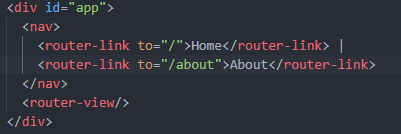
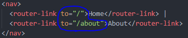
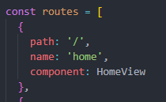
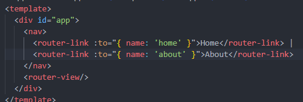

# Vue Router

## Routing

### Routing

* 네트워크 경로 선택 프로세스

* 웹 서비스에서의 라우팅
  * 유저가 방문한 URL에 대해 적절환 결과 응답
* /articles/index/접근 시 articles의 index에 대한 결과 보내ㅜㅁ


### Routing in SSR

* Server가 모든 라우팅 통제
* URL로 요청이 들어오면 응답으로 완성된 HTML 제공
  * Django로 보낸 요청의 응답 HTML은 완성본인 상태였음
* 결론적으로, Routing(URL)에 대한 결정권을 서버가 가짐


### Routing in SPA / CSR

* 서버는 하나의 HTML(index.html) 만을 제공
* 이후에 모든 동작은 하나의 HTML 문서 위에서 JavaScript 코드 활용
  * DOM을 그리는데 필요한 추가적인 데이터가 있으면 axios와 같은 AJAX 요청을 보낼 수 있는 도구를 사용해 데이터 가져오고 처리
  * 즉, **하나의 URL만 가질 수 있음**

### Why routing?

* 동작에 따라 URL이 반드시 바뀌어야 하나?
  * No, but, 유저의 사용성 관점에서는 필요
* Routing이 없다면,
  * 유저가 URL을 통한 페이지의 변화 감지 불가
  * 페이지가 무엇을 렌더링 중인지에 대한 상태 알 수 X
    * 새로고침 시 처음 페이지로 돌아감
    * 링크 공유할 시 처음 페이지만 공유 가능
  * 뒤로가기 기능 사용 불가

## Vue Router

### Vue Router

* Vue 공식 라우터
* SPA 상에서 라우팅을 쉽게 개발할 수 있는 기능 제공
* 라우트(rotues)에 컴포넌트 매핑한 후, 어떤 URL에 렌더링 할지 알려줌
  * 즉, SPA를 MPA(Multiple Page Application)처럼 URL 이동하면서 사용 가능
  * SPA 단점 ㅈ우 하나인 "URL이 변경되지 않는다" 해결
* [참고] MPA
  * 여러 개의 페이지로 구성된 애플리케이션
  * SSR 방식으로 렌더링

=> 페이지는 하나인데! 사용자가 페이지 이동하는 것 처럼 느끼게!


### Vue Router 시작하기

* Vuex와 마찬가지의 방식으로 설치 및 반영

```
$ vue create vue-router-app
$ cd vue-router-app
$ veu add router
```

### History mode

* 브라우저의 History API를 활용한 방식
  * 새로고침 없이 URl 이동 기록 남길 수 있음
* 우리에게 익숙한 URL 구조 사용 가능
  * ex) http://localhost:8080/index
* History mode 안쓰면 Default값인 hash mode로 설정
  * ex) http://localhost:8080#index


사용자에게 이동한 듯한 느낌

사용자 경험 입장에서 다음으로 이동했다는 느낌을 받게함

SPA에서는 원래 안되던거 (URL 고정돼서)

기술적으로 페이지는 하나임

component만 갈아 끼우는 것

= vue router의 역할


router/index.js


### router-link

* a태그와 비슷한 기능 -> URL 이동
  * routes에 등록된 컴포넌트와 매핑
  * 히스토리 모드에서 router-link는 클릭 이벤트 차단하여 a태그와 달리 브라우저가 페이지를 다시 로드 하지 않도록 함
* 목표 경로는 'to'송성으로 지정됨
* 기능에 맞게 HTML에서 a태그로 rendering 되지만, 필요에 따라 다르 태그로 바꿀 수 있음




### router-view

* 주어진 URL에 대해 일치하는 컴포넌트를 렌더링 하는 컴포넌트
* 실제 component가 DOM에 부착되어 보이는 자리 의미
* router-link를 클릭하면 routes에 매핑된 컴포넌트 렌더링


* Django에서의 block tag와 비슷
  * App.vue는 base.html의 역할
  * router-view는 block 태그로 감싼 부분

=> router link 클릭하면 router-view 부분에 매핑된 컴포넌트 렌더링


### src/router/index.js

* 라우터에 관련된 정보 및 설정이 작성 되는 곳
* Django에서의 urls.py에 해당
* routers에 URL과 컴포넌트 매핑

vued의 routes와 django의 urlpattterns 매우 유사


### src/Views

component 넣을 수 있는 곳 2곳

components, views

* router-view에 들어갈 component 작성
* 기존에 컴포넌트 작성하던 곳은 components 폴더 뿐이었지만 이제 두 폴더로 나뉘어짐
* 각 폴더 안의 .vue 파일들이 기능적으로 다른 것은 아님
* router랑 매핑이 되는 component들은 views에 작성
* 그렇지 않은 애들은 components에 작성
* => 기능상의 차이는 X


컴포넌트 배치는 다음과 같이 진행(규약은 아님)

* views/
  * routes에 매핑되는 컴포넌트,
    * 즉 <router-view>의 위치에 렌더링 되는 컴포넌트를 모아두는 폴더
    * 다른 컴포넌트와 구분하기 위해 View로 끝나도록 만드는 것 권장
    * ex) App 컴포넌트 내부의 AboutView & HomeView 컴포넌트
  * components/
    * routes에 매핑된 컴포넌트의 하위 컴포넌트를 모아두는 폴더
    * ex) HomeView 컴포넌트 내부의 HelloWorld 컴포넌트


## Router 실습

### 주소를 이동하는 2가지 방법

1. 선언적 방식 네비게이션 : 선언해서 이동
2. 프로그래밍 방식 네비게이션 : 프로그래밍 코드를 짜서 이동


### 선언적 방식 네비게이션

* router-link의 'to' 속성으로 주소 전달
  * routes에 등록된 주소와 매핑된 컴포넌트로 이동



### Named Routes

* 이름을 가지는 routes
  * Django에서 path 함수의 name 인자의 활용과 같은 방식



* 동적인 값을 사용하기 때문에 v-bind를 사용해야 정상적으로 작동



### 프로그래밍 방식 네비게이션

* Vue 인스턴스 내부에서 라우터의 인스턴스에 $router로 접근 할 수 있음
* 다른 URL로 이동하려면 this.$router.push 사용
  * history stack에 이동할 URL을 넣는(push) 방식
  * history stack에 기록이 남기 때문에 사용자가 브라우저의 뒤로 가기 버튼을 클릭하면 이전 URL로 이동할 수 있음
* 결국 <router-link :to="...">를 클릭하는 것과 $router.push(...)를 호출하는 것은 같은 동작


### Dynamic Route Matching

* 동적 인자 전달
  * URL의 특정 값을 변수처럼 사용할 수 있음
* ex) Django에서의 variable routing


* HelloView.vue 작성 및 route 추가
* route를 추가할 때 동적 인자 명시


* $route.params로 변수에 접근 가능


* 다만 HTML에서 직접 사용하기 보다는 data에 넣어서 사용하는 것 권장


### Dynamic Route Matching - 선언적 방식 네비게이션

* params를 이용하여 동적 인자 전달 가능


### Dynamic Route Matching - 프로그래밍 방식 네비게이션


### route에 컴포넌트를 등록하는 또다른 방법

* router/index.js에 컴포넌트를 등록하는 또다른 방식이 주어지고 있음(about)


### lazy-loading

* 모든 파일을 한 번에 로드하려고 하면 모든 걸 다 읽는 시간이 매우 오래 걸림
* 미리 로드를 하지 않고 특정 라우트에 방문할 때 매핑된 컴포넌트의 코드를 로드하는 방식을 활용할 수 있음
  * 모든 파일을 한 번에 로드하지 않아도 되기 때문에 최초에 로드하는 시간이 빨라짐
  * 당장 사용하지 않을 컴포넌트는 먼저 로드하지 않는 것이 핵심


## 네비게이션 가드

### 네비게이션 가드

* Vue router를 통해 특정 URL에 접근할 때 다른 url로 rediret를 하거나 해동 URL로 접근을 막는 방법

### 종류

* 전역 가드
  * 애플리케이션 전역에서 동작
* 라우터 가드
  * 특정 URL에서만 동작
* 컴포넌트 가드
  * 라우터 컴포넌트 안에 정의


### 전역 가드 (Global Before Guard)

* 다른 url 주소로 이동할 때 항상 실행
* router/index.js에 router.beforeEach()를 사용하여 설정
* 콜백 함수의 값으로 다음과 같이 3개의 인자를 받음
  * to : 이동할 URL 정보가 담긴 Route 객체
  * from : 현재 URL 정보가 담긴 Route 객체
  * next : 지정한 URL로 이동하기 위해 호출하는 함수
    * 콜백 함수 내부에서 반드시 한 번만 호출되야 함
    * 기본적으로 to에 해당하는 URL로 이동

* URL이 변경되어 화면이 전환되기 전 router.beforeEach()가 호출됨
  * 화면이 전환되지 않고 대기 상태가 됨
* 변경된 URL로 라우팅하기 위해서는 next()를 호출해줘야 함
  * next()가 호출되기 전까지 화면이 전환되지 않음
