# 가상 메모리 관리 (Virtual Memory Management)

### Virtual Memory Management

가장 우선시 되는 목적은 성능 최적화

Cost model : 비용을 최소화 시킬 수 있는 기법

### Cost Model for Virtual Mem. Sys.

Page fault : 가장 많이 쓰는 cost model

페이지 프레임 단위로 잘려져 있는데 swap device에서 memory 오렬 쓰는데 cpu가 찾으려 하는게 없으면 page fault 발생 

kernel이 개입하면 overhead가 큼 => page fault rate이 크다 == overhead가 크다

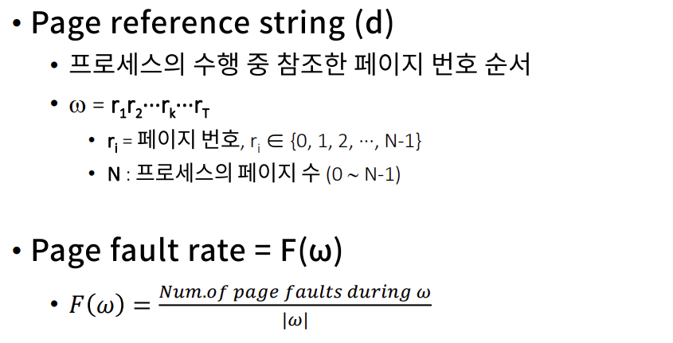

page reference string : 어떤 페이지를 어떤 순서로 참조했는지 적어 놓는 것 ( 왜 적어놈?)

=> 정보가 있어야 효율적으로 사용하고 있는지 아닌지 비교할 수 있음

ex) 효율적 알고리즘을 설계하기 위한 기준, 평가

|| => 절댓값이기도 한데 개수 의미도 함

|w| : 프로세스가 참조했던 페이지 수(길이)

분자 : page fault가 발생한 수

F(w) : 전체 참조한 개수 중 몇 번 fault가 났는가

### Hardware Components

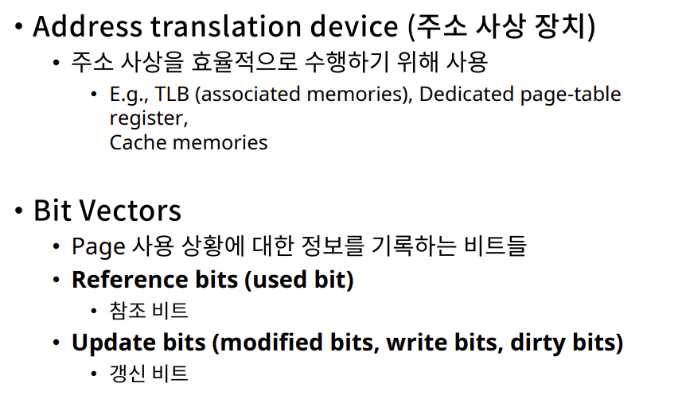

전용 레지스터 두기도 함

Bit Vectors : bit들이 array로 있는 것, 메모리 상에서 페이지들을 효율적으로 관리하기 위해선 정보가 필요함

프로세스에게 할당된 모든 pf이 가득차 있을 때 새로운 pf가 필요하면 어디다가 넣을 까?

선택하려면 정보, 기준이 필요함, 이때 필요한게 bit vectors

reference bits : pf들이 참조 됐니 안됐니 기록

update bits : pf들이 갱신되었는가(dirty bits 많이 씀,{데이터가 더렵혀 졌다})

### Bit Vectors

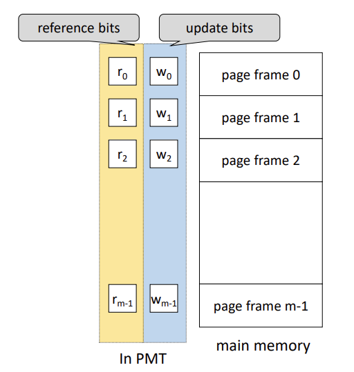

PMT에 넣어 놓고 정보 관리

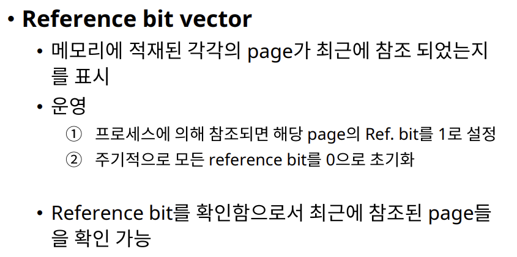

참조 됬는지 기록하는데 그 중에 가장 최근에 참조 됐는가

주기적으로 0으로 만들어 주어야 함(특정 기간 마다 reset해서 그 사이 동안 참조되었는지)

=> locality!

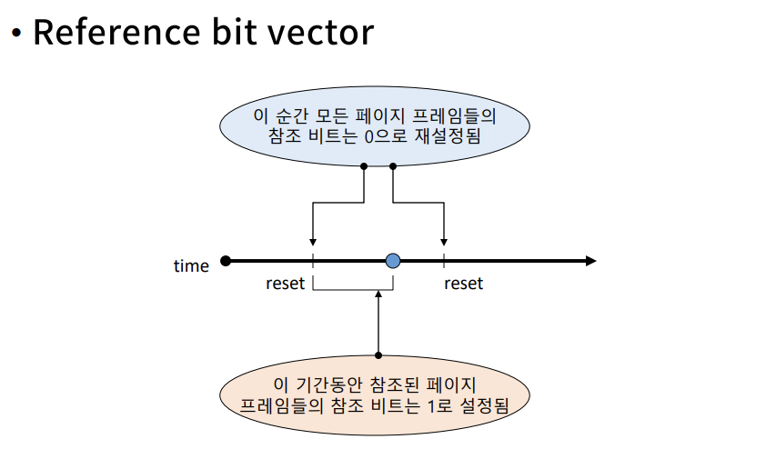

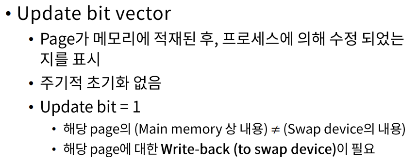

pf에 page가 올라와 있을때 page 데이터를 바꿀 수 도 있음, 이걸 표시

굳이 왜 기록?

=> pf에 있는 값과 swapdevice 값이 같을 까? ㄴㄴ

메모리 상에 값만 바뀐거고 swapdevice와는 서로 다른 데이터 가지고 있음

작업 다하고 나올때 변환 된 것을 반영해 주어야 함(write-back) => 데이터 무결성 유지

나올 때 0으로 초기화 (주기적으로 하는게 아님)

### Software Components

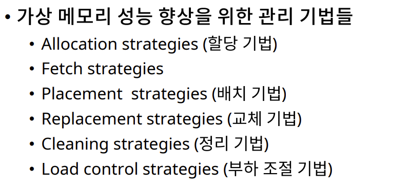

### Allocation Strategies

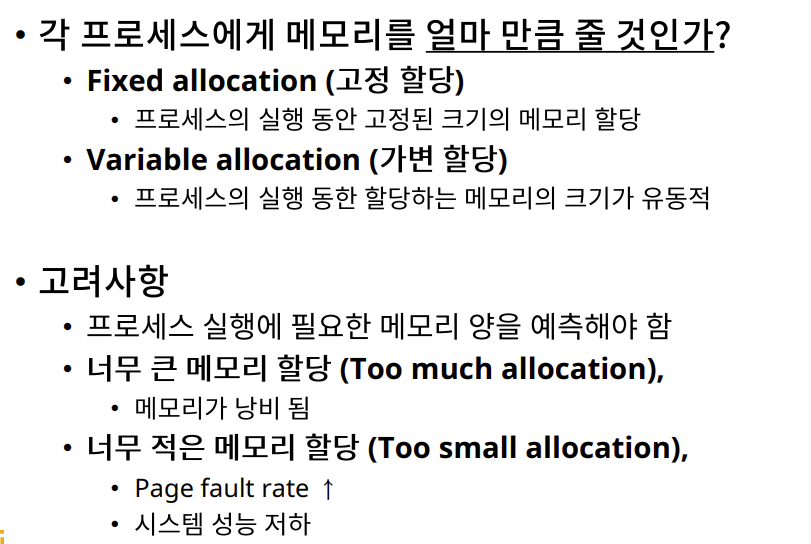

fixed allocation : ex) pageframe 고정해서 주는 것

variable allocation : pf 수가 변하는 것

얼마 만큼 주는게 좋을 까? => 적당히

메모리 너무 많이 주면 낭비되고 너무 적으면 page fault rate 증가해서 성능 저하

### Fetch Strategies

fetch : 데이터 가져 오는 것

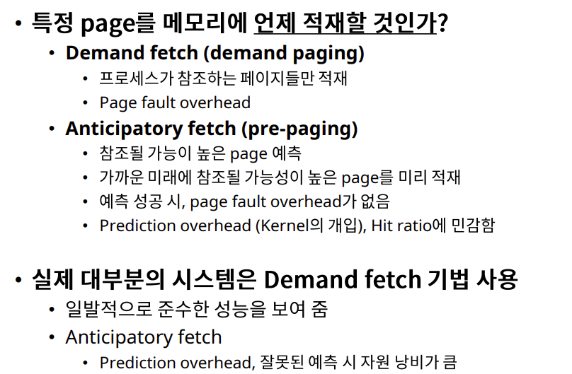

Demand fetch : 언제 가져올 꺼? 필요할 때! 

Anticipatory fetch : pre-paging이라는 용어 더 많이 씀, 참조될 꺼 같으면 미리 가져옴

=> page fault overhead 줄일 수 있음

=> 예측 실패 시는 overhead가 크게 발생할 수 있고 예측해야되는 overhead가 있을 수 있음

따라서 얼마나 맞추나 Hit ratio 민감

대부분 Demand fetch 사용

anticipatory fetch : 실패하면 자원 낭비 너무 큼

### Placement Strategies

paging system은 공간 일정하니 불필요 하긴 함

### Replacement Strategies

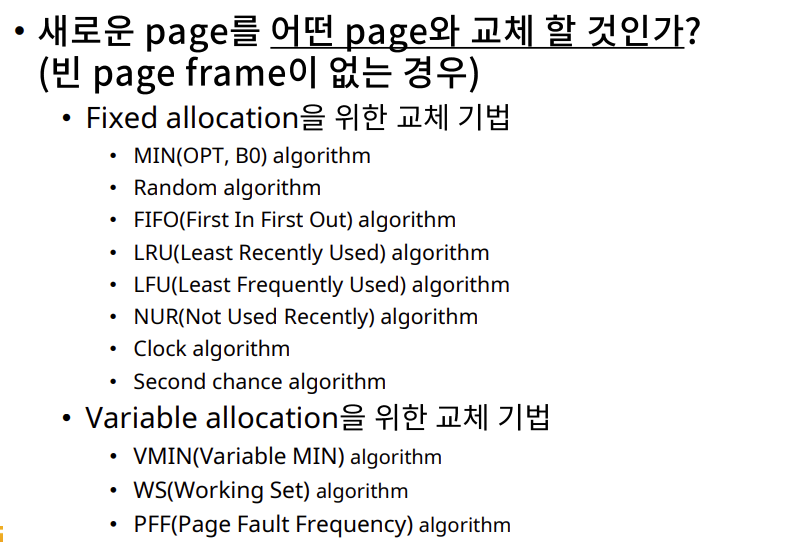

Replacement Strategies : ABC 가득 차 있을 때 D를 넣으려 할때 누구를 빼고 넣을 것인가

### Cleaning Strategies

dirty한걸(dirty bit) 치우는 strategy

값이 바꼈을 때 dirty bit = 1, swap device와 값이 다르니깐 다른 내용 반영해 줘야 함(write-back)

Cleaning Strategy와 유사

기본적으로 page가 메모리에서 나올 때, 예측 해서 더 이상 안바뀔 거 같을 때 미리 write-back

=> 나올 때 안해도 되니깐 시간 절약 가능

=> but 안쓸 꺼 같았는데 쓰면 overhea가 더 생김

이것도 실제로는 대부분 Demand cleaning 기법 사용

### Load Control Strategies

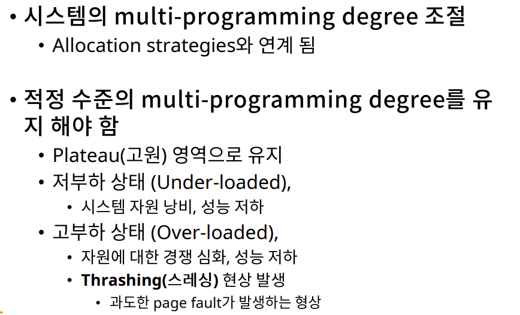

multi-programming degree : 시스템에 들어온 process 수, 많으면 로드 크고 적으면 적고

100개 프로세스 가질 때와 1개 프로세스 가질 때 달라야함

적당하지 않을 때

너무 낮을 때 (저부하) => 100개중 10개면 쓰면 낭비

높을때 (over) => 경쟁 심하고 성증 낮아짐

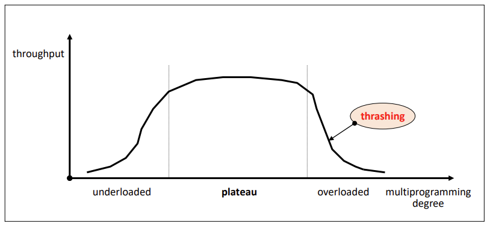

thrasing : 한글에서 enter 5초 눌렀다 떼면 경험해볼 수 있음

### Locality

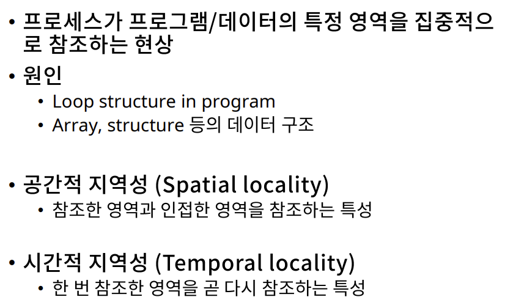

### Example

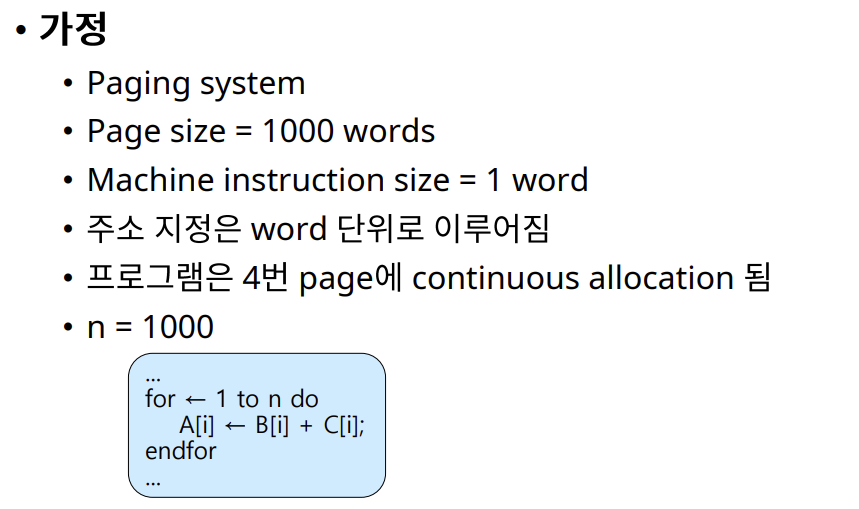

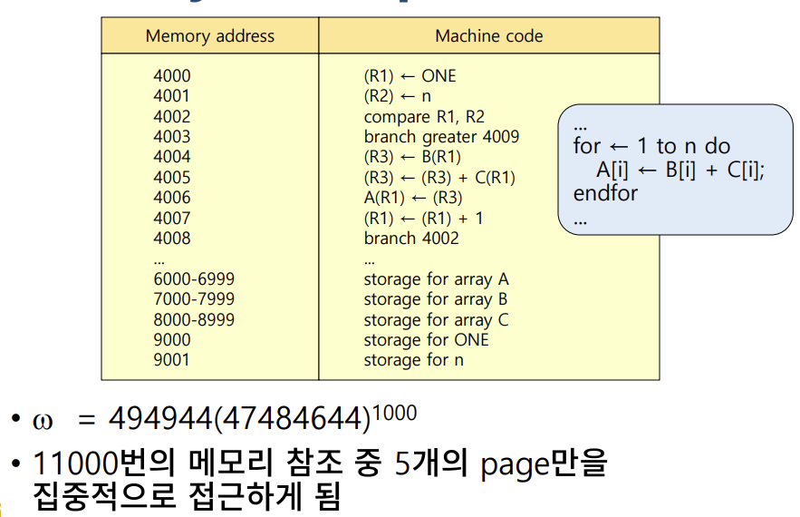

locality 활용하면 성능을 높일 수 있다!

### Replacement Strategies

fixed : 정해진 수의 pf 고정

다 차 있는데 누가 들어오려 하면 내보내고 들어옴 (교체)

누굴 교체할 것인가? => Repalcement Strategies

### Min Algorithm (OPT algorithm)

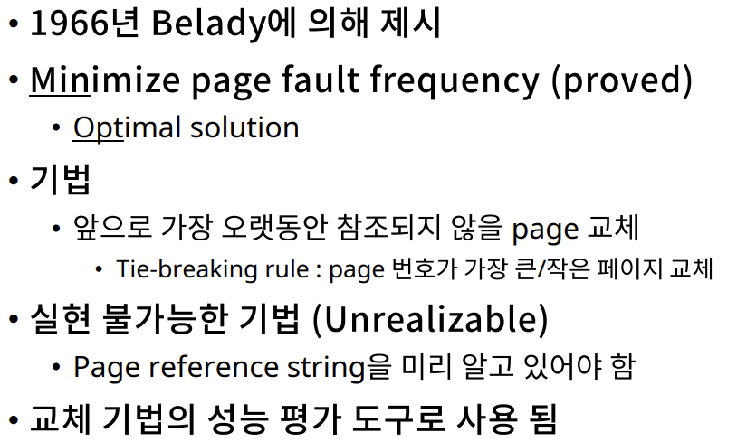

가장 메모리 관리할 때 page fault를 최소로 만드는 것(증명됐음)

4, 5, 6 가지고 있는데 7번이 들어오려 하면 reference string 알고 있다는 가정 하에 가장 오래 안 쓸 애를 교체

but 어케암 실현 불가능

근데 왜 배움? OS 만들 때 X 를 만들었는데 얼마나 최적인지 비교할 때, 다른 교체 기법의 기준이 될 수 있음

미래를 알고 있으니 y를 교체

time 6에서 6이 가장 늦게 보니깐 6번을 바꿔줌

time 12에서 동점일 때 tie-breaking-rule : 우리가 정하면 됨

page fault 6번남 : 최적임

### Random Algorithm

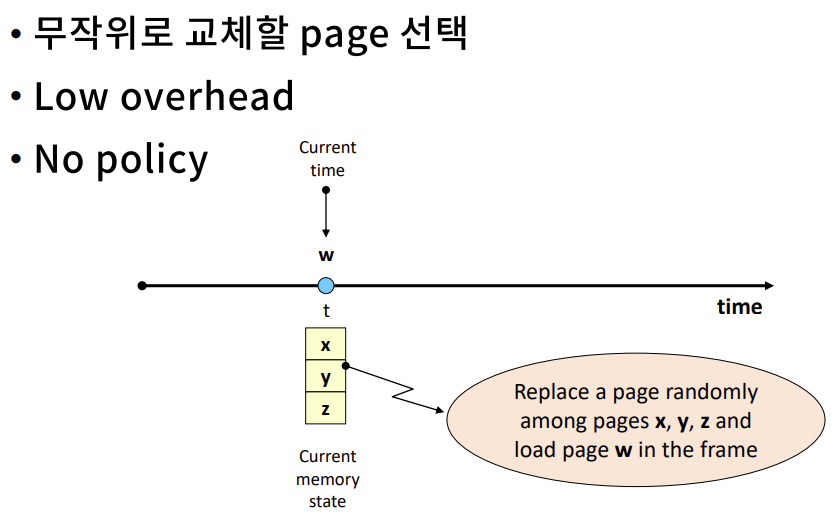

또 다른 성능 평가의 기준

### FIFO Algorithm

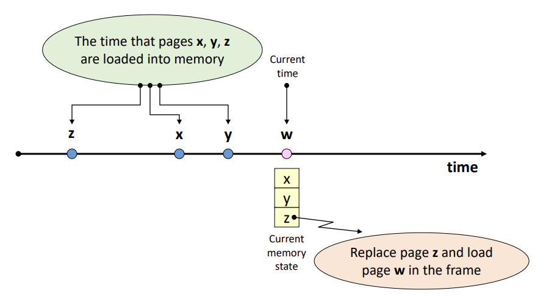

z가 가장 오래 됐으니 z교체

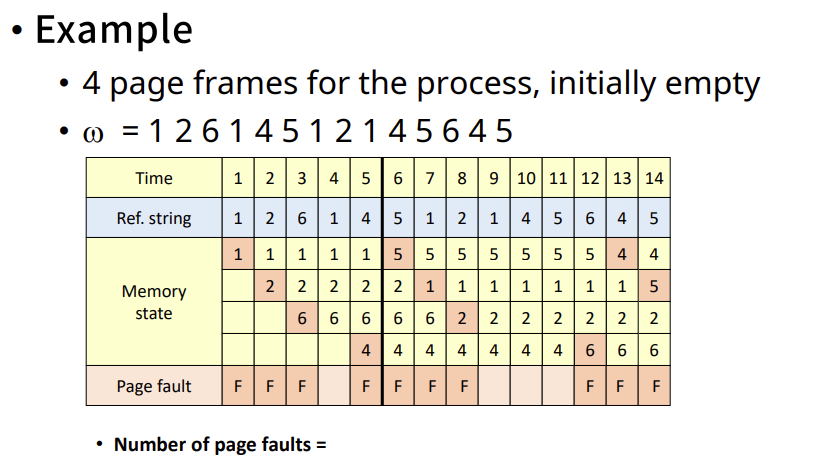

time 6 : 1번이 가장 먼저 들어왔으니 교체

time 7 : 2번이 가장 먼저 들어왔으니 교체

time 8 : 2번 교체

time 12 : 4번 교체

등등등

=> number of page faults : 8번 발생함, min 보다 확실히 안좋긴 함

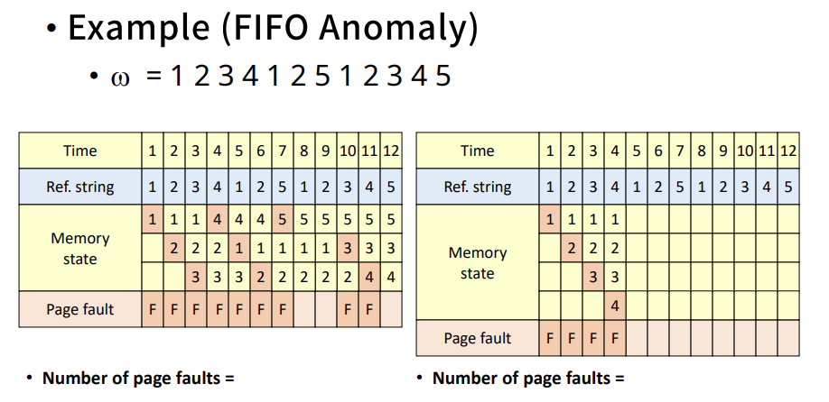

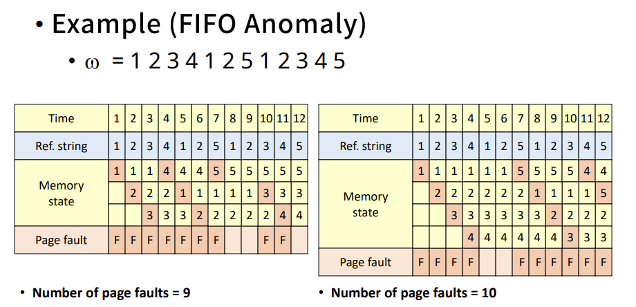

너무 안좋아서 pf 더 주는 전략을 쓰면

pf 4개 할당하면 오히려 page fault 늘어남

자원은 늘렸는데 성능은 감소함 = FIFO Anomaly

=> locality를 고려하지 않았으므로

### LRU(Least Recently Used) Algorithm

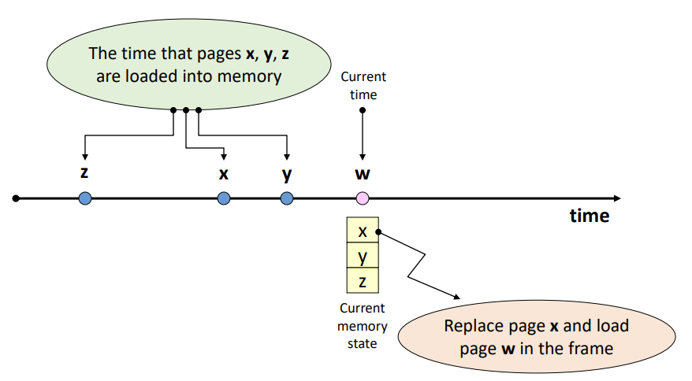

x가 참조가 가장 오래 됐으면 x 교체

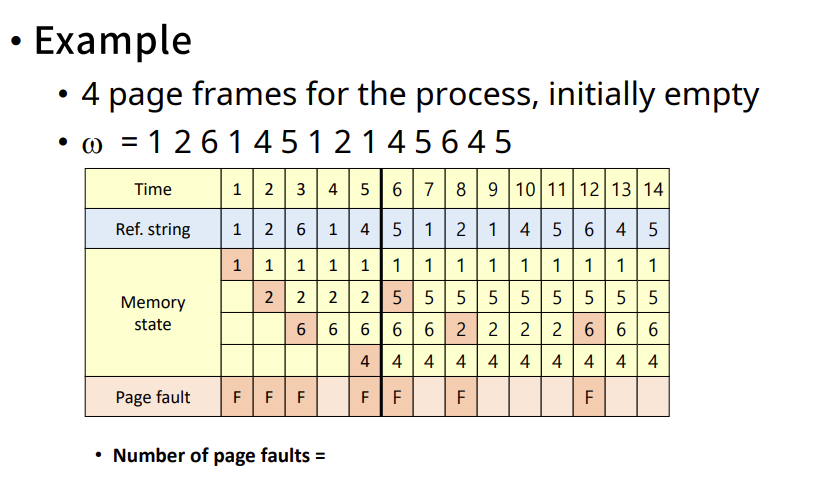

time 6 : 2번을 본지 가장 오래됐으니깐 교체

등등등

number of page faults : 7 (min algorithm과 거의 유사)

but 참조 될때 마다 시간 기록해야하니 오버헤드 발생 가능